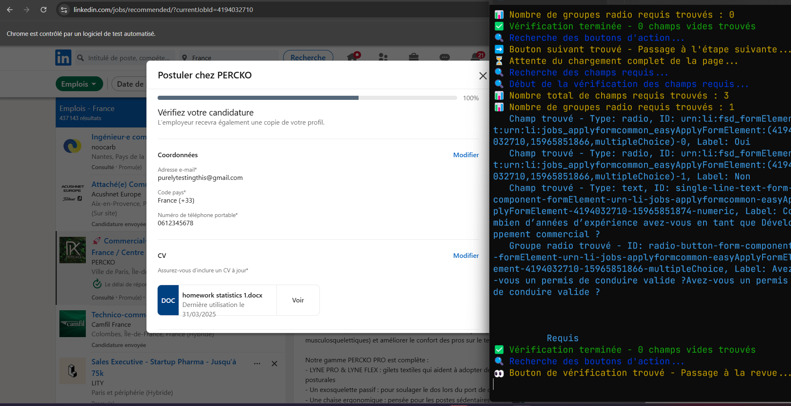

# LinkedIn Easy Apply Bot 🤖

An automated bot that helps you apply for jobs on LinkedIn using the "Easy Apply" feature.


# WARNING : This script only works if you linkedin language is set to 'FR - French', For now...



## 🌟 Features

- Automatically finds and applies to "Easy Apply" jobs on LinkedIn
- Handles various types of application forms:
  - Text inputs
  - Radio buttons
  - Checkboxes
  - Select dropdowns
- Smart form filling based on context
- Automatic company unsubscribe after application
- Application tracking in CSV format
- Discord webhook integration for real-time notifications
- Error handling and logging

## 🛠️ Prerequisites

- Node.js
- Google Chrome browser
- LinkedIn account
- Discord webhook URL (optional, for notifications)

## 📦 Installation

1. Clone the repository

```bash
git clone https://github.com/JulienGuinot/LinkedinMadeEasy.git
```

2. Install dependencies

```bash
npm install
```


3. Create a `.env` file in the root directory with:

```
DISCORD_WEBHOOK_URL=your_discord_webhook_url
```


## 🚀 Usage

1. Configure your LinkedIn profile and login to Chrome
2. Run the bot:

```
npm start
```


## 💡 How it Works

The bot performs the following steps:

1. Launches Chrome with your profile
2. Navigates to LinkedIn jobs page
3. Scans for "Easy Apply" jobs
4. For each job:
   - Extracts job details
   - Clicks "Easy Apply"
   - Fills application forms intelligently
   - Submits application
   - Logs application details
   - Sends Discord notification
   - Moves to next job

## 📊 Data Collection

The bot collects and stores:
- Job title
- Company name
- Location
- Experience level
- Required skills
- Contract type
- Number of applicants
- Benefits

## ⚙️ Configuration

You can customize the bot's behavior by modifying:
- Form filling strategies in `src/form/HandleQuestions/`
- Job search criteria in `src/scrap/job_details.ts`
- Error handling in `src/errors/`

## 🔒 Security

- The bot uses your existing Chrome profile
- No passwords or sensitive data are stored
- All data is saved locally

## ⚠️ Disclaimer

This bot is for educational purposes only. Use it responsibly and in accordance with LinkedIn's terms of service.

## 🤝 Contributing

Contributions are welcome! Please feel free to submit a Pull Request.

## 📝 License

This project is licensed under the MIT License - see the LICENSE file for details.